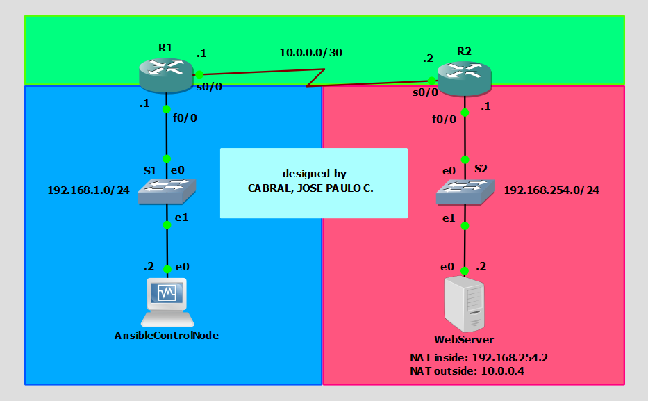

# Network Automation Using Ansible
A finals case study for ***CPE 028-CPE41S3 - Developing Applications and Automation***.<br>

Code written and design made by: **Pau Cabral**

## Requirements
### Hardware
* Computer installed with GNS3 (preferably with 16GB RAM or higher)
### Software
* GNS3
* Cisco 3725 appliance and IOS image
* VirtualBox (or other Virtualization Software/Hypervisor)
* GNS3 VM (if not using Linux natively)
* Ubuntu Image
* Linux Distribution with *Ansible* Support (preferably DEVASC Lab VM)

**NOTE:** In this design's case, KVM support for nested virtualization is not required since the routers do not need VMs of their own.

## Network Topology


### Devices
* 1 x Ansible Control Node (DEVASC Lab VM)
* 1 x Web Server (Ubuntu 20.04 installed with Apache 2)
* 2 x Cisco 3725 Router 
* 2 x Switch

### Basic Device Configurations
Basic configuration is required in order for the *Ansible* control node to establish a connection among the hosts.

#### Ansible Control Node
##### SSH Config (`~/.ssh/config`)
```bash
Host *    
    # For GNS3 Cisco C3725
    Port 22
    User cisco
    StrictHostKeyChecking=no
    UserKnownHostsFile=/dev/null
    KexAlgorithms +diffie-hellman-group1-sha1
    Ciphers +3des-cbc

    # For other Linux hosts 
    SendEnv LANG LC_*
    Ciphers +aes256-cbc
```
##### Netplan (`/etc/netplan/01-netcfg.yaml`)
```yaml
network:
  version: 2
  renderer: networkd
  ethernets:
    enp0s3:
      dhcp4: no
      addresses:
        - 192.168.1.2/24
      gateway4: 192.168.1.1
```
```bash
$ sudo netplan apply
```

#### Web Server (Ubuntu 20.04)
##### Apache 2 
```
$ sudo apt-get update && sudo apt-get install apache2
```
```
$ sudo systemctl start apache2 && sudo systemctl enable apache2
```
##### Netplan (`/etc/netplan/01-netcfg.yaml`)
```yaml
network:
  version: 2
  renderer: networkd
  ethernets:
    enp0s3:
      dhcp4: no
      addresses:
        - 192.168.254.2/24
      gateway4: 192.168.254.1
```
```bash
$ sudo netplan apply
```

#### Router 1
```
hostname R1
!
boot-start-marker
boot-end-marker
!
enable password cisco123
!
no aaa new-model
memory-size iomem 5
no ip icmp rate-limit unreachable
ip cef
!
!
!
!
no ip domain lookup
ip domain name www.abc.com
!
multilink bundle-name authenticated
!
!
!
!
!
!
!
!
!
!
!
!
!
!
!
!
!
!
!
!
!
username cisco password 0 cisco123
archive
 log config
  hidekeys
! 
!
!
!
ip tcp synwait-time 5
ip ssh version 2
!
!
!
!
interface FastEthernet0/0
 ip address 192.168.1.1 255.255.255.0
 duplex auto
 speed auto
!
interface Serial0/0
 ip address 10.0.0.1 255.255.255.252
 clock rate 128000
!
interface FastEthernet0/1
 no ip address
 shutdown
 duplex auto
 speed auto
!
interface Serial0/1
 no ip address
 shutdown
 clock rate 2000000
!
interface Serial0/2
 no ip address
 shutdown
 clock rate 2000000
!
interface Serial0/3
 no ip address
 shutdown
 clock rate 2000000
!
interface Serial0/4
 no ip address
 shutdown
 clock rate 2000000
!
interface FastEthernet1/0
 no ip address
 shutdown
 duplex auto
 speed auto
!
interface Serial2/0
 no ip address
 shutdown
 serial restart-delay 0
!
interface Serial2/1
 no ip address
 shutdown
 serial restart-delay 0
!
interface Serial2/2
 no ip address
 shutdown
 serial restart-delay 0
!
interface Serial2/3
 no ip address
 shutdown
 serial restart-delay 0
!
ip forward-protocol nd
ip route 0.0.0.0 0.0.0.0 10.0.0.2
!
!
no ip http server
no ip http secure-server
!
no cdp log mismatch duplex
!
!
!
!
!
!
control-plane
!
!
!
!
!
!
!
!
!
!
line con 0
 exec-timeout 0 0
 privilege level 15
 logging synchronous
line aux 0
 exec-timeout 0 0
 privilege level 15
 logging synchronous
line vty 0 4
 login local
 transport input ssh
line vty 5 15
 login local
 transport input ssh
!
!
end
```

#### Router 2
```
hostname R2
!
boot-start-marker
boot-end-marker
!
enable password cisco123
!
no aaa new-model
memory-size iomem 5
no ip icmp rate-limit unreachable
ip cef
!
!
!
!
no ip domain lookup
ip domain name www.abc.com
!
multilink bundle-name authenticated
!
!
!
!
!
!
!
!
!
!
!
!
!
!
!
!
!
!
!
!
!
username cisco password 0 cisco123
archive
 log config
  hidekeys
! 
!
!
!
ip tcp synwait-time 5
ip ssh version 2
!
!
!
!
interface FastEthernet0/0
 ip address 192.168.254.1 255.255.255.0
 duplex auto
 speed auto
!
interface Serial0/0
 ip address 10.0.0.2 255.255.255.252
 clock rate 128000
!
interface FastEthernet0/1
 no ip address
 shutdown
 duplex auto
 speed auto
!
interface Serial0/1
 no ip address
 shutdown
 clock rate 2000000
!
interface Serial0/2
 no ip address
 shutdown
 clock rate 2000000
!
interface Serial0/3
 no ip address
 shutdown
 clock rate 2000000
!
interface Serial0/4
 no ip address
 shutdown
 clock rate 2000000
!
interface FastEthernet1/0
 no ip address
 shutdown
 duplex auto
 speed auto
!
interface Serial2/0
 no ip address
 shutdown
 serial restart-delay 0
 clock rate 128000
!
interface Serial2/1
 no ip address
 shutdown
 serial restart-delay 0
!
interface Serial2/2
 no ip address
 shutdown
 serial restart-delay 0
!
interface Serial2/3
 no ip address
 shutdown
 serial restart-delay 0
!
ip forward-protocol nd
ip route 0.0.0.0 0.0.0.0 10.0.0.1
!
!
no ip http server
no ip http secure-server
!
no cdp log mismatch duplex
!
!
!
!
!
!
control-plane
!
!
!
!
!
!
!
!
!
!
line con 0
 exec-timeout 0 0
 privilege level 15
 logging synchronous
line aux 0
 exec-timeout 0 0
 privilege level 15
 logging synchronous
line vty 0 4
 login local
 transport input ssh
line vty 5 15
 login local
 transport input ssh
!
!
end
```

**NOTE:** On routers, enter global configuration mode by entering `configure terminal` after `enable`, then generate a crypto key using the command `crypto key gen rsa` with modulus set to `1024`. This is needed for SSH.

## Automation Using Ansible
### Preparing the Ansible `hosts` file
Everything is almost setup according to the basic configuration except for the `webserver` node, as its credentials may differ depending on user setup of user login credentials. These can be changed inside the `hosts` file by simply modifying the `ansible_user` variable to the account username and the `ansible_password` variable to the account password. The user account must be a sudoer and thus needs to be granted by providing a sudo password in the `ansible_become_pass` variable. Preferrably, passwordless sudo can be setup on the `webserver` node as well and the `ansible_become_pass` variable can be left as blank (`ansible_become_pass = ""`). See [hosts](hosts) file for more information.

### Executing the Playbook/s
Several playbooks were constructed dedicated for each specific set of tasks for specific set of hosts. Ultimately, these were consolidated into a [master playbook](playbook.yaml) arranged in an ideal sequence of execution. This can be executed by simply running the command below:

```bash
$ ansible-playbook playbook.yaml
```

#### List of Playbooks
* playbook.yaml (master playbook)
* test_ansible-node_connectivity.yaml
* backup_startup-config.yaml
* get_ipv4.yaml
* eigrp-config.yaml
* nat-config.yaml
* acl-config.yaml
* backup_running-config.yaml
* deploy-static-html.yaml